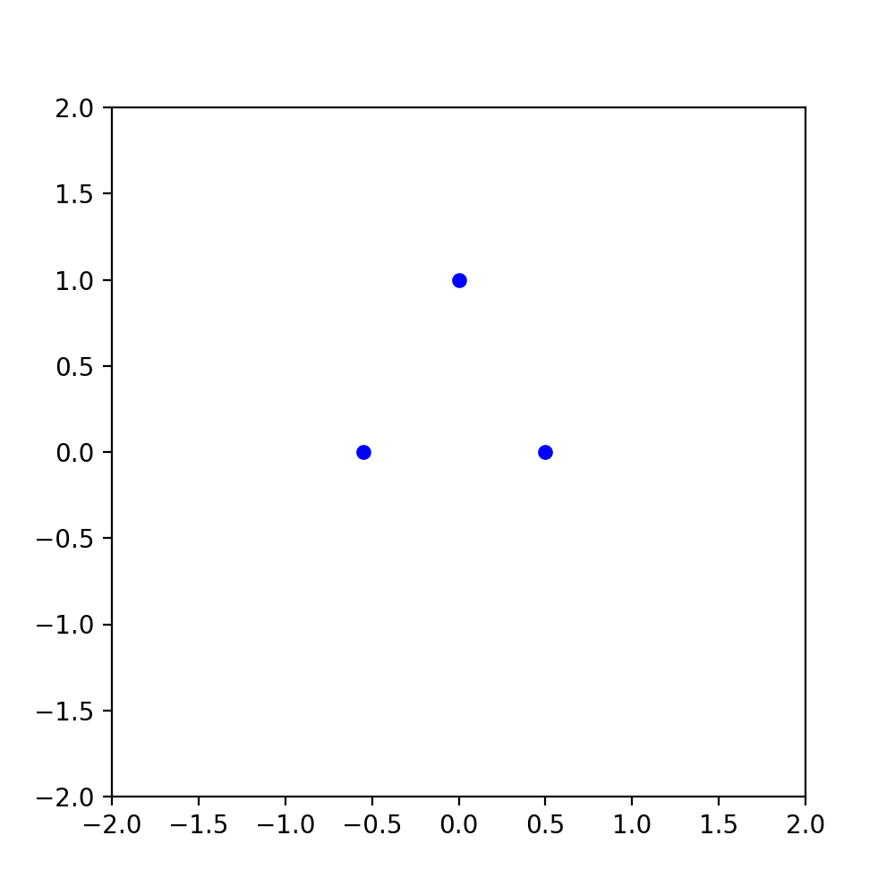

# Simulation of the three body problem

Using the equations $r_{ij}$ for the distances and $a_{direction, i}$ for acceleration.

$$
r_{12} = \sqrt{(x_1-x_2)^2+(y_1-y_2)^2} \\\

r_{13} = \sqrt{(x_1-x_3)^2+(y_1-y_3)^2} \\\

r_{23} = \sqrt{(x_2-x_3)^2+(y_2-y_3)^2} \\\

a_{x1} = -\frac{m_2}{r_{12}^3}(x_1-x_2)-\frac{m_3}{r_{13}^3}(x_1-x_3) \\\

a_{y1} = -\frac{m_2}{r_{12}^3}(y_1-y_2)-\frac{m_3}{r_{13}^3}(y_1-y_3) \\\

a_{x2} = -\frac{m_1}{r_{12}^3}(x_2-x_1)-\frac{m_3}{r_{23}^3}(x_2-x_3) \\\

a_{y2} = -\frac{m_1}{r_{12}^3}(y_2-y_1)-\frac{m_3}{r_{23}^3}(y_2-y_3) \\\

a_{x3} = -\frac{m_1}{r_{13}^3}(x_3-x_1)-\frac{m_2}{r_{23}^3}(x_3-x_2) \\\

a_{y3} = -\frac{m_1}{r_{13}^3}(y_3-y_1)-\frac{m_2}{r_{23}^3}(y_3-y_2)
$$

with the inital conditions:

$m_1=10$ and $m_2=m_3=1$

$$
\begin{bmatrix}
    x \\\
    y \\\
\end{bmatrix} = \left\lbrace
\begin{bmatrix}
    0 \\\
    1 \\\
\end{bmatrix}, 
\begin{bmatrix}
    -0.55 \\\
    0 \\\
\end{bmatrix},
\begin{bmatrix}
    0.5 \\\
    0 \\\
\end{bmatrix} \right\rbrace
$$

$$
\begin{bmatrix}
    v_x \\\
    v_y \\\
\end{bmatrix} = \left\lbrace
\begin{bmatrix}
    0 \\\
    -0.6 \\\
\end{bmatrix},
\begin{bmatrix}
    0.6 \\\
    0.6 \\\
\end{bmatrix}, 
\begin{bmatrix}
    -0.6 \\\
    0.6 \\\
\end{bmatrix}\right\rbrace
$$